# Flowchart
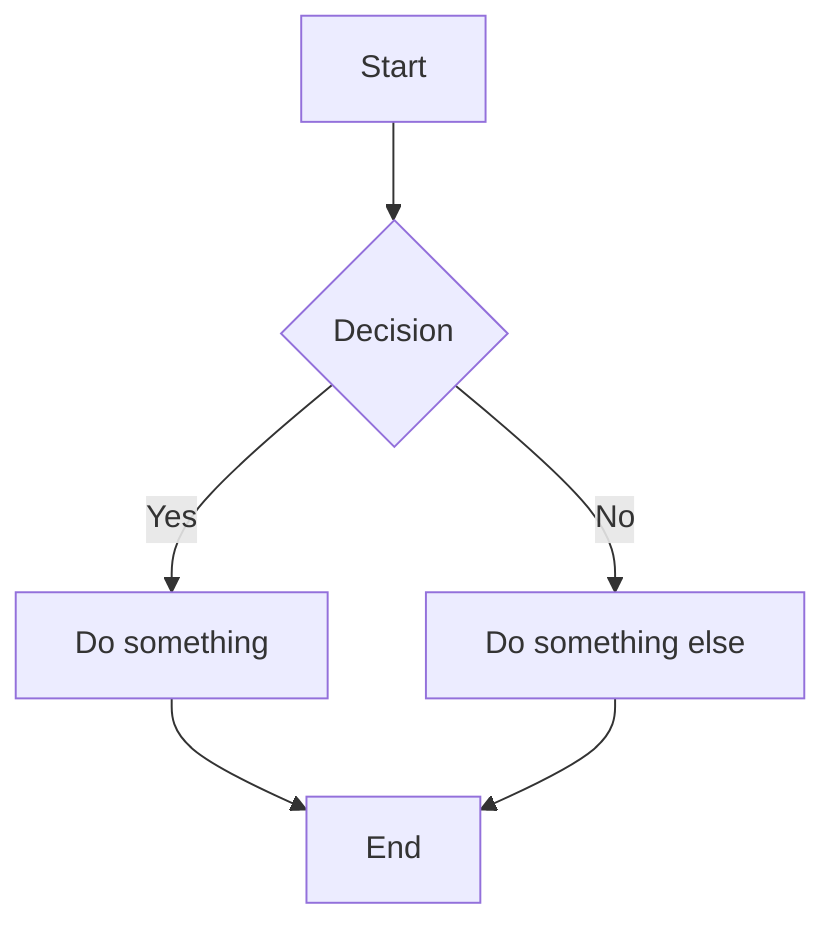
```mermaid
flowchart TD
    A[Start] --> B{Decision}
    B -->|Yes| C[Do something]
    B -->|No| D[Do something else]
    C --> E[End]
    D --> E
```

# Sequence Diagram
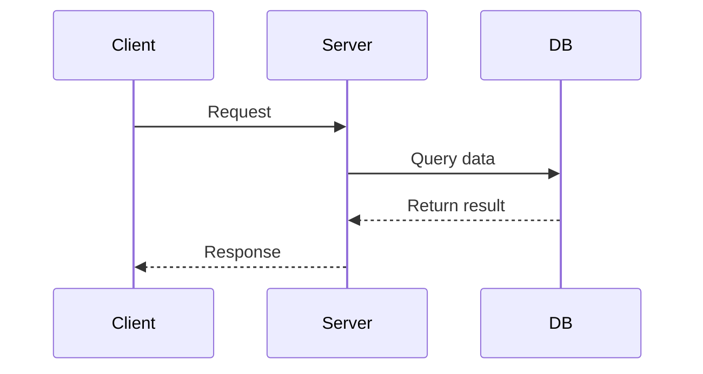
```mermaid
sequenceDiagram
    participant Client
    participant Server
    participant DB

    Client->>Server: Request
    Server->>DB: Query data
    DB-->>Server: Return result
    Server-->>Client: Response
```

# Class Diagram
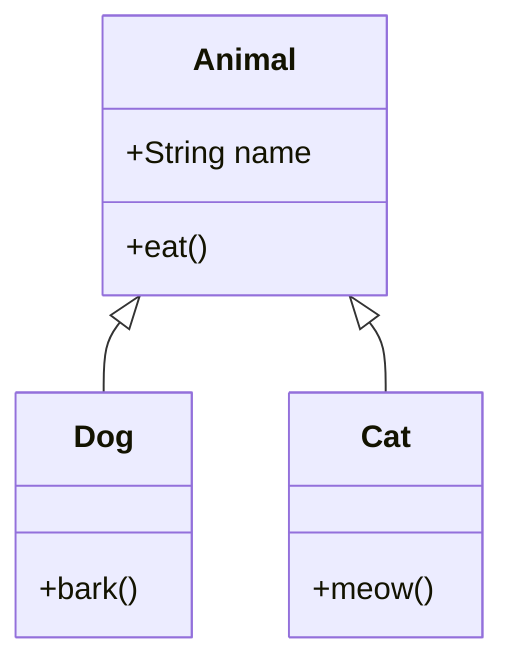
```mermaid
classDiagram
    Animal <|-- Dog
    Animal <|-- Cat
    Animal : +String name
    Animal : +eat()
    Dog : +bark()
    Cat : +meow()
```

# State Diagram
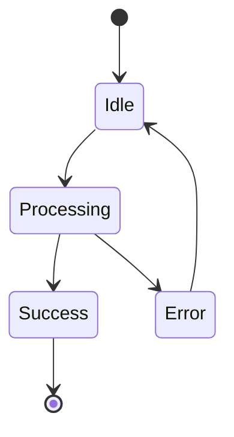
```mermaid
stateDiagram-v2
    [*] --> Idle
    Idle --> Processing
    Processing --> Success
    Processing --> Error
    Error --> Idle
    Success --> [*]
```

# ER Diagram
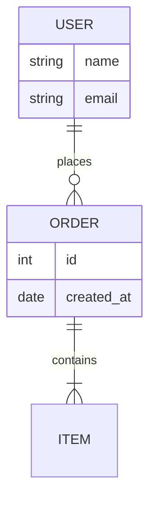
```mermaid
erDiagram
    USER ||--o{ ORDER : places
    ORDER ||--|{ ITEM : contains
    USER {
        string name
        string email
    }
    ORDER {
        int id
        date created_at
    }
```

# Gantt Chart
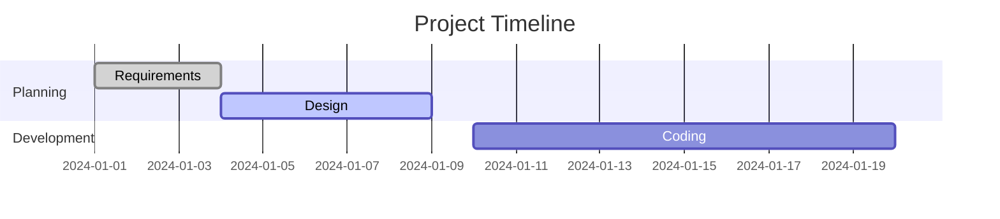
```mermaid
gantt
    title Project Timeline
    dateFormat  YYYY-MM-DD
    section Planning
    Requirements :done,    des1, 2024-01-01, 3d
    Design       :active,  des2, 2024-01-04, 5d
    section Development
    Coding       :         des3, 2024-01-10, 10d
```

# Pie Chart
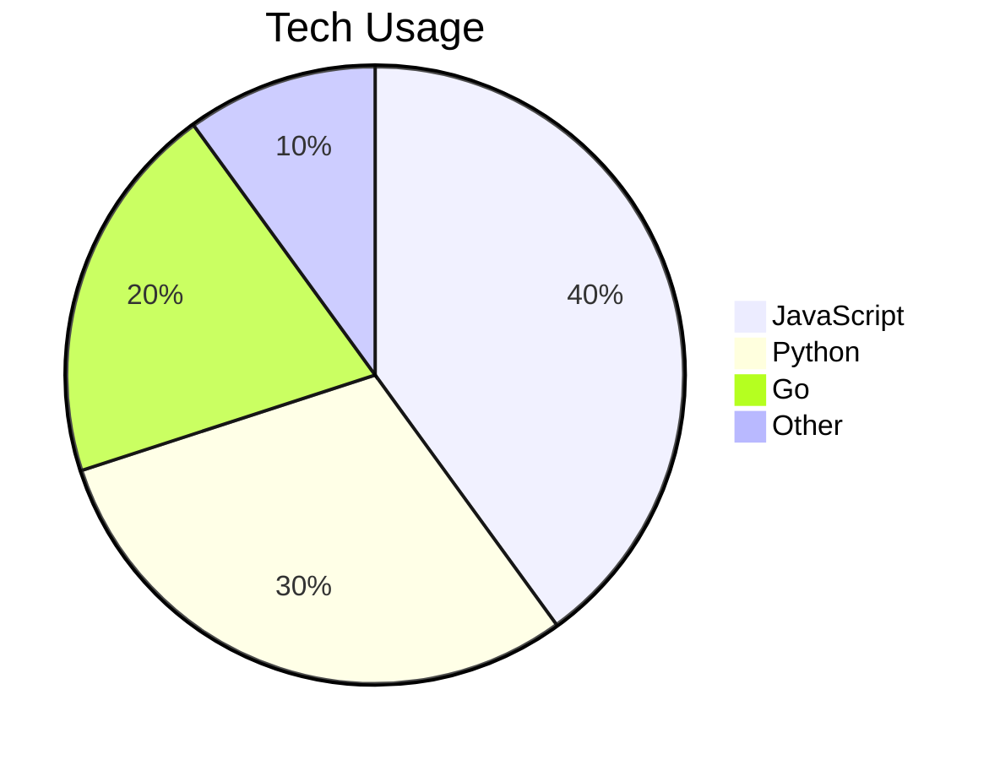
```mermaid
pie
    title Tech Usage
    "JavaScript" : 40
    "Python" : 30
    "Go" : 20
    "Other" : 10
```

# Journey Diagram
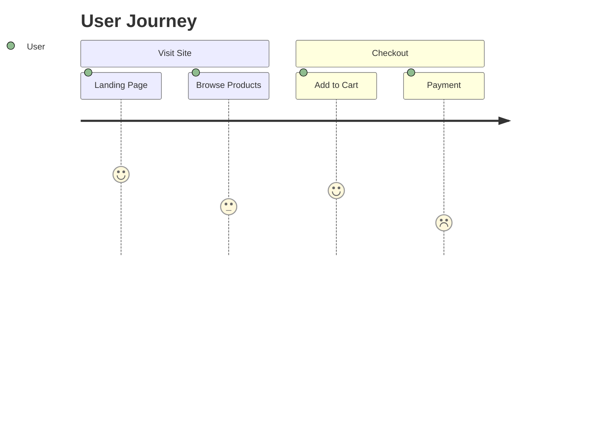
```mermaid
journey
    title User Journey
    section Visit Site
      Landing Page: 5: User
      Browse Products: 3: User
    section Checkout
      Add to Cart: 4: User
      Payment: 2: User
```

# Git Graph
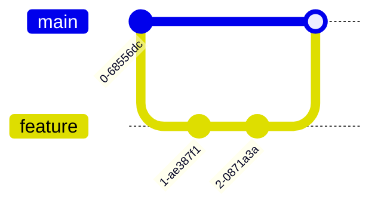
```mermaid
gitGraph
    commit
    branch feature
    checkout feature
    commit
    commit
    checkout main
    merge feature
```

# Requirement Diagram
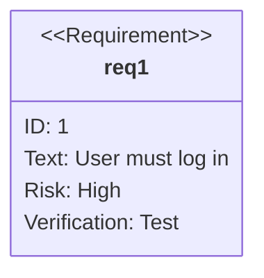
```mermaid
requirementDiagram
    requirement req1 {
        id: 1
        text: User must log in
        risk: high
        verifymethod: test
    }
```

# Mindmap
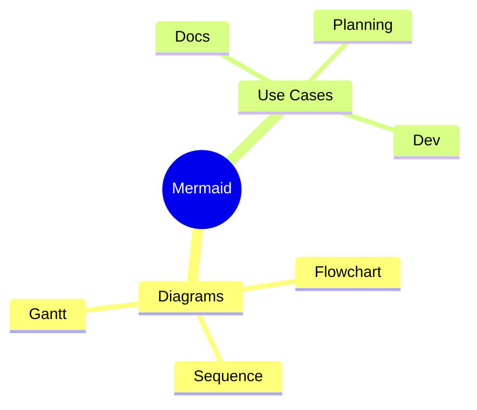
```mermaid
mindmap
  root((Mermaid))
    Diagrams
      Flowchart
      Sequence
      Gantt
    Use Cases
      Docs
      Planning
      Dev
```

# Timeline
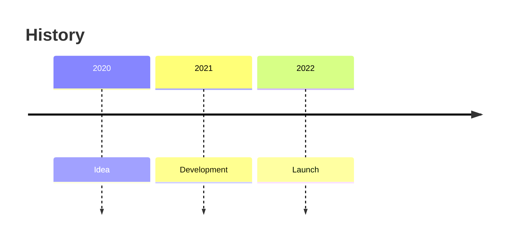
```mermaid
timeline
    title History
    2020 : Idea
    2021 : Development
    2022 : Launch
```
